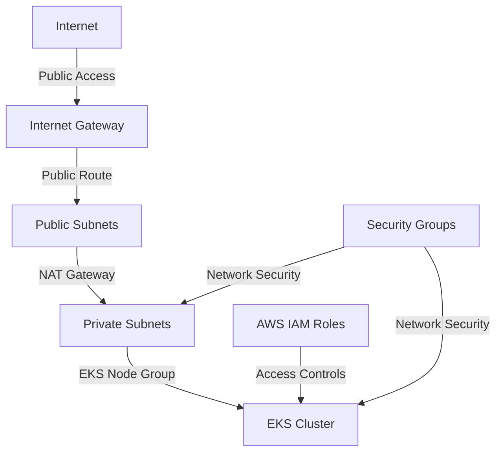
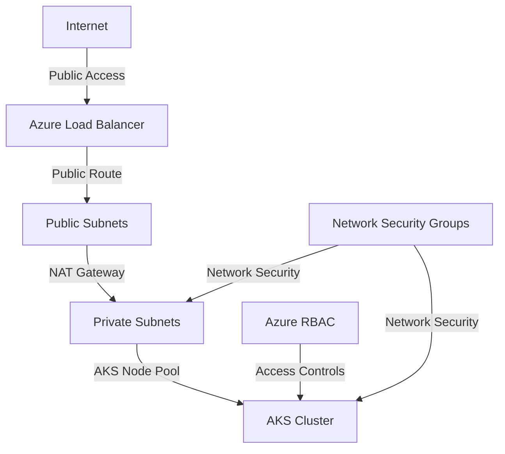
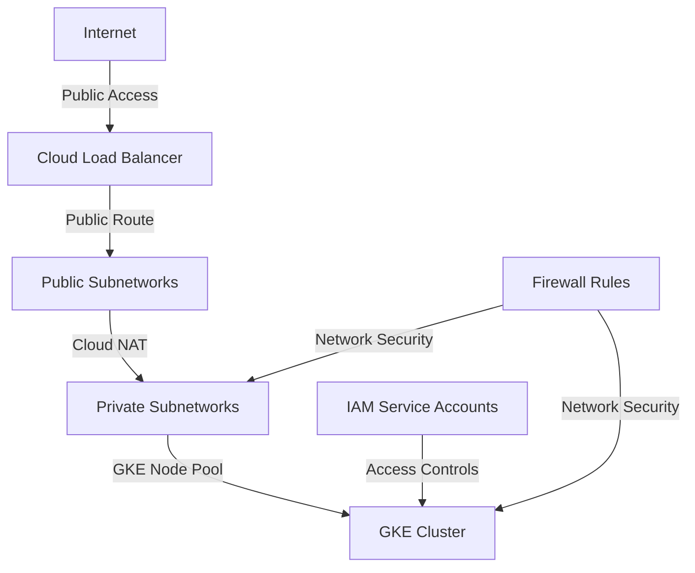

```markdown
# Cloud Polyglot IaC


[](https://opensource.org/licenses/MIT)

A production-ready Infrastructure as Code repository for deploying and managing multi-cloud Kubernetes environments across AWS, Azure, and Google Cloud Platform.

## Overview

Cloud Polyglot IaC is a comprehensive solution for organizations adopting multi-cloud strategies, providing:

- **Consistent infrastructure** across AWS (EKS), Azure (AKS), and GCP (GKE)
- **Modular architecture** with shared networking components
- **Automated testing** using Terratest
- **CI/CD integration** with GitHub Actions
- **Comprehensive documentation** including cost comparisons and architecture diagrams

This repository serves as both a reference architecture and a practical starting point for organizations looking to standardize their cloud infrastructure practices.

## Table of Contents

- [Features](#features)
- [Architecture](#architecture)
- [Repository Structure](#repository-structure)
- [Prerequisites](#prerequisites)
- [Getting Started](#getting-started)
- [Modules](#modules)
  - [AWS (EKS)](#aws-eks)
  - [Azure (AKS)](#azure-aks)
  - [GCP (GKE)](#gcp-gke)
  - [Common Networking](#common-networking)
- [Testing](#testing)
- [CI/CD Pipeline](#cicd-pipeline)
- [Cloud Cost Comparison](#cloud-cost-comparison)
- [Contributing](#contributing)
- [License](#license)

## Features

- **Multi-cloud Kubernetes Deployment**: Consistent configuration for EKS, AKS, and GKE
- **Secure Networking**: VPC/VNet configuration with public and private subnets
- **IAM/RBAC Integration**: Least-privilege security configurations
- **Automated Testing**: Infrastructure validation with Terratest
- **CI/CD Ready**: GitHub Actions workflow for automated validation
- **Cost-Optimized**: Configurable node pools with autoscaling
- **Well-Documented**: Architecture diagrams and detailed documentation

## Architecture

The architecture implements a standardized approach across cloud providers:

### AWS Architecture


### Azure Architecture


### GCP Architecture


## Repository Structure

```
cloud-polyglot-iac/
├── .github/
│   └── workflows/
│       └── ci.yml           # CI/CD pipeline configuration
├── aws/                     # AWS/EKS module
│   ├── main.tf              # Main infrastructure code
│   ├── variables.tf         # Input variables
│   └── outputs.tf           # Output values
├── azure/                   # Azure/AKS module
│   ├── main.tf              # Main infrastructure code
│   ├── variables.tf         # Input variables
│   └── outputs.tf           # Output values
├── gcp/                     # GCP/GKE module
│   ├── main.tf              # Main infrastructure code
│   ├── variables.tf         # Input variables
│   └── outputs.tf           # Output values
├── common-networking/       # Shared networking library
│   ├── main.tf              # Common networking definitions
│   └── variables.tf         # Input variables for networking
├── tests/                   # Terratest files
│   ├── aws_test.go          # AWS/EKS tests
│   ├── azure_test.go        # Azure/AKS tests
│   ├── gcp_test.go          # GCP/GKE tests
│   ├── validate_test.go     # Syntax validation tests
│   ├── run_tests.sh         # Test runner script
│   └── go.mod               # Go module file
├── README.md                # Project documentation
└── CHANGELOG.md             # Version history
```

## Prerequisites

- Terraform (>= 1.0.0)
- Go (>= 1.18) for running tests
- AWS, Azure, or GCP account with appropriate permissions
- Cloud provider CLI tools configured:
  - AWS CLI
  - Azure CLI
  - Google Cloud SDK

## Getting Started

1. **Clone the repository**:
   ```bash
   git clone https://github.com/yourusername/cloud-polyglot-iac.git
   cd cloud-polyglot-iac
   ```

2. **Select your cloud provider module**:
   ```bash
   cd aws    # For AWS/EKS
   # OR
   cd azure  # For Azure/AKS
   # OR
   cd gcp    # For GCP/GKE
   ```

3. **Initialize Terraform**:
   ```bash
   terraform init
   ```

4. **Create your configuration file**:
   Create a `terraform.tfvars` file with your specific variables.

5. **Plan your deployment**:
   ```bash
   terraform plan -out=tfplan
   ```

6. **Apply the configuration**:
   ```bash
   terraform apply tfplan
   ```

## Modules

### AWS (EKS)

The AWS module provisions a production-ready EKS cluster with:

- VPC with public and private subnets across multiple Availability Zones
- EKS cluster with managed node groups
- IAM roles with least privilege principles
- Security groups for cluster communication
- NAT Gateways for private subnet internet access

#### Key Variables

| Name | Description | Type | Default | Required |
|------|-------------|------|---------|:--------:|
| region | The AWS region to deploy to | `string` | `"us-east-1"` | no |
| project_name | The name of the project | `string` | n/a | yes |
| environment | The environment (dev, staging, prod) | `string` | `"dev"` | no |
| kubernetes_version | The Kubernetes version to use | `string` | `"1.28"` | no |

### Azure (AKS)

The Azure module provisions a production-ready AKS cluster with:

- Virtual Network with public and private subnets
- AKS cluster with auto-scaling node pools
- Azure RBAC integration
- Network Security Groups for secure communication
- NAT Gateway for private subnet internet access

#### Key Variables

| Name | Description | Type | Default | Required |
|------|-------------|------|---------|:--------:|
| location | The Azure region to deploy to | `string` | `"eastus"` | no |
| project_name | The name of the project | `string` | n/a | yes |
| environment | The environment (dev, staging, prod) | `string` | `"dev"` | no |
| kubernetes_version | The Kubernetes version to use | `string` | `"1.28.0"` | no |

### GCP (GKE)

The GCP module provisions a production-ready GKE cluster with:

- VPC Network with public and private subnetworks
- GKE cluster with auto-scaling node pools
- IAM service accounts with least privilege
- Firewall rules for secure communication
- Cloud NAT for private subnet internet access

#### Key Variables

| Name | Description | Type | Default | Required |
|------|-------------|------|---------|:--------:|
| project_id | The GCP project ID | `string` | n/a | yes |
| region | The GCP region to deploy to | `string` | `"us-central1"` | no |
| project_name | The name of the project | `string` | n/a | yes |
| environment | The environment (dev, staging, prod) | `string` | `"dev"` | no |

### Common Networking

A shared networking library that provides consistent configurations across cloud providers:

- CIDR block allocation
- Subnet configurations
- DNS settings
- Tagging standards

## Testing

The project includes comprehensive tests using [Terratest](https://terratest.gruntwork.io/):

```bash
cd tests
./run_tests.sh
```

These tests validate:
- Infrastructure syntax and configuration
- Module output values
- Resource creation workflows

## CI/CD Pipeline

The repository includes GitHub Actions workflows that automatically:

1. Validate Terraform syntax
2. Run tests on pull requests
3. Generate infrastructure plans for review

To use the CI/CD pipeline, configure the following secrets in your GitHub repository:

- `AWS_ACCESS_KEY_ID` and `AWS_SECRET_ACCESS_KEY` (for AWS tests)
- `ARM_CLIENT_ID`, `ARM_CLIENT_SECRET`, `ARM_SUBSCRIPTION_ID`, `ARM_TENANT_ID` (for Azure tests)
- `GOOGLE_CREDENTIALS` and `GOOGLE_PROJECT` (for GCP tests)

## Cloud Cost Comparison

Below is an approximate monthly cost comparison for a small Kubernetes cluster on each cloud provider:

| Cloud Provider | Resource | Size | Quantity | Estimated Monthly Cost (USD) |
|----------------|----------|------|----------|------------------------------|
| AWS | EKS Cluster | n/a | 1 | $73 |
| AWS | EC2 Instances (t3.medium) | 2 vCPU, 4 GB RAM | 2 | $60 |
| AWS | NAT Gateway | n/a | 3 | $99 |
| AWS | Load Balancer | n/a | 1 | $16 |
| AWS | **Total** | | | **$248** |
| | | | | |
| Azure | AKS Cluster | n/a | 1 | $0 (no management fee) |
| Azure | VM (Standard_DS2_v2) | 2 vCPU, 7 GB RAM | 2 | $140 |
| Azure | NAT Gateway | n/a | 1 | $32 |
| Azure | Load Balancer | n/a | 1 | $18 |
| Azure | **Total** | | | **$190** |
| | | | | |
| GCP | GKE Cluster | n/a | 1 | $72 |
| GCP | VM (e2-medium) | 2 vCPU, 4 GB RAM | 2 | $48 |
| GCP | Cloud NAT | n/a | 1 | $32 |
| GCP | Load Balancer | n/a | 1 | $18 |
| GCP | **Total** | | | **$170** |

**Note**: Costs are approximate and may vary based on region, usage patterns, and pricing changes.

## Contributing

Contributions are welcome! Please follow these steps:

1. Fork the repository
2. Create a feature branch (`git checkout -b feature/amazing-feature`)
3. Commit your changes (`git commit -m 'Add some amazing feature'`)
4. Push to the branch (`git push origin feature/amazing-feature`)
5. Open a Pull Request

See [CONTRIBUTING.md](CONTRIBUTING.md) for detailed guidance.

## License

This project is licensed under the MIT License - see the [LICENSE](LICENSE) file for details.

---

_Developed with ❤️ for the multi-cloud community_
```